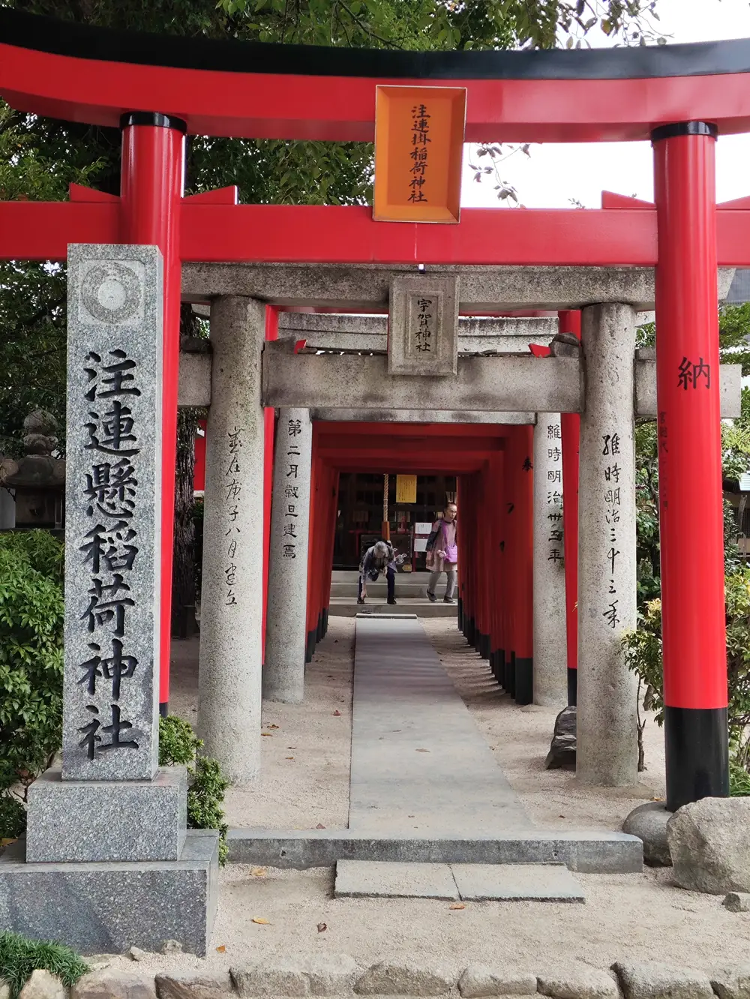
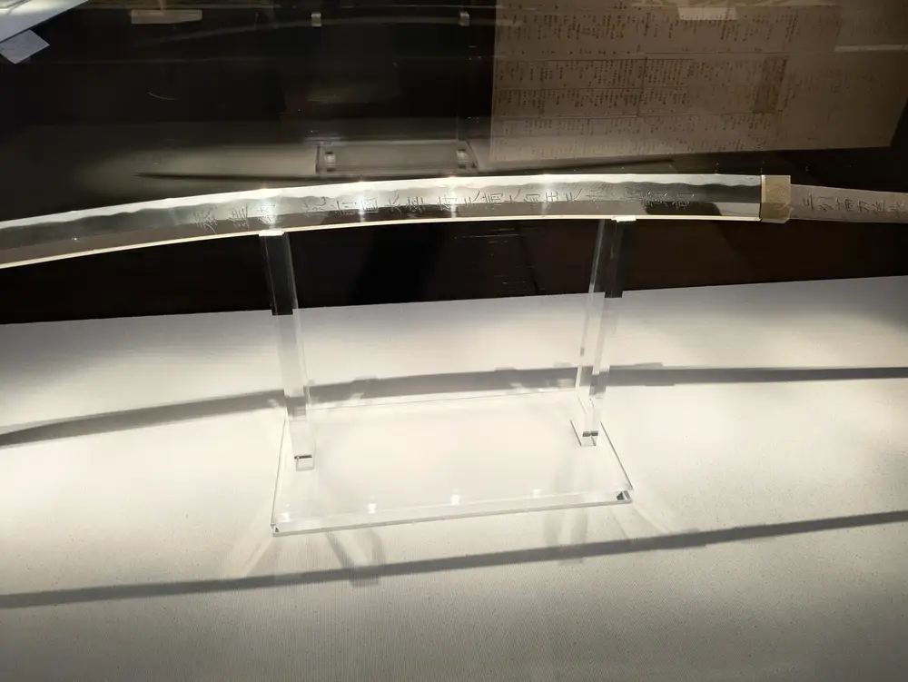
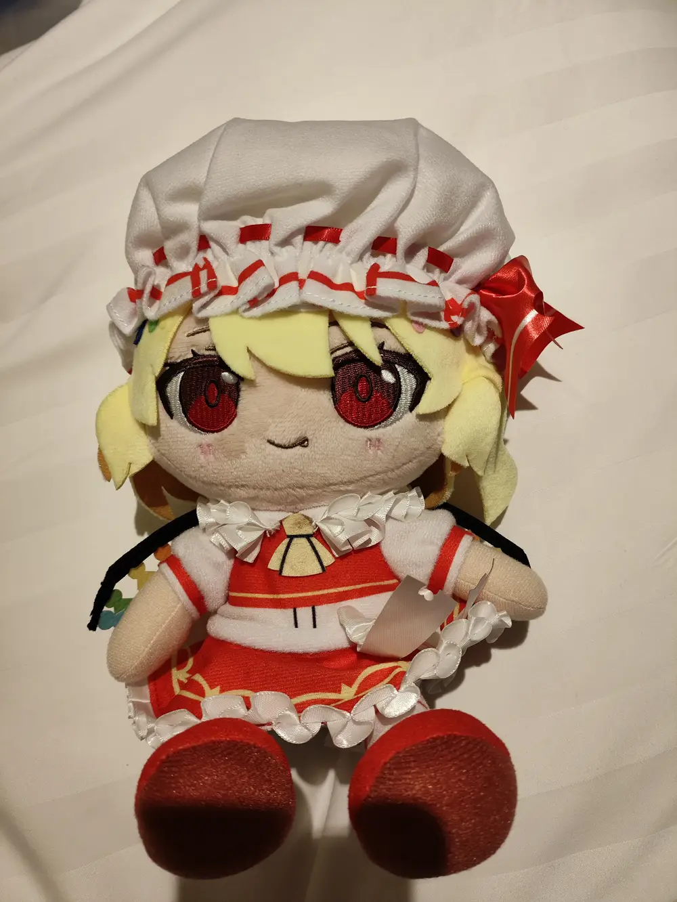
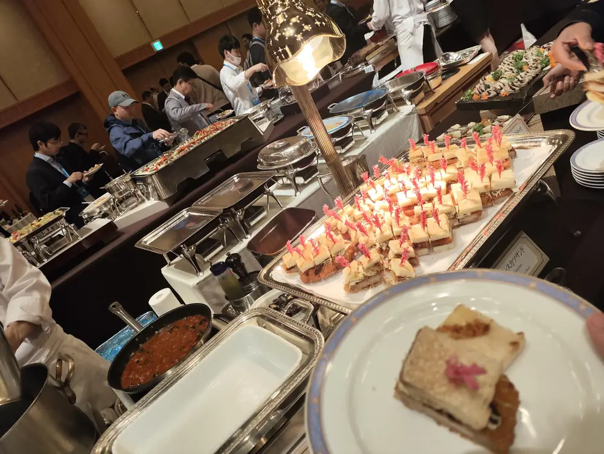
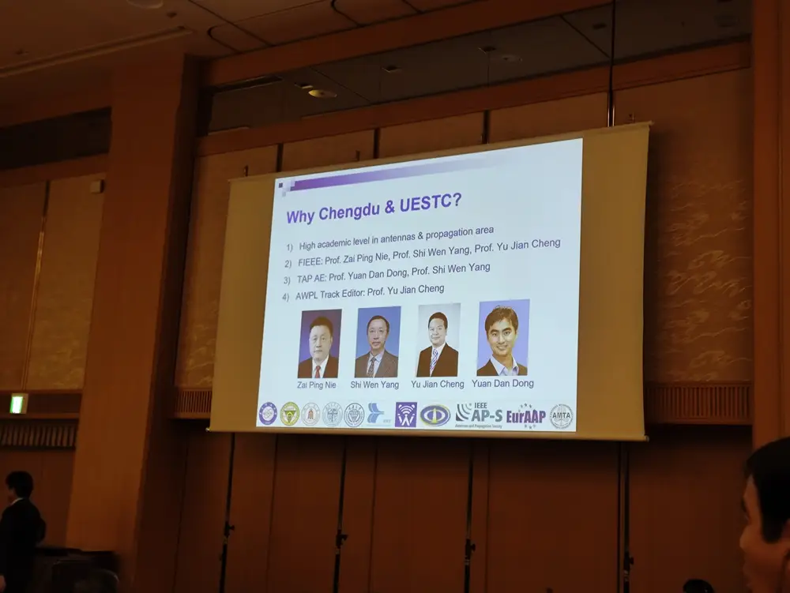
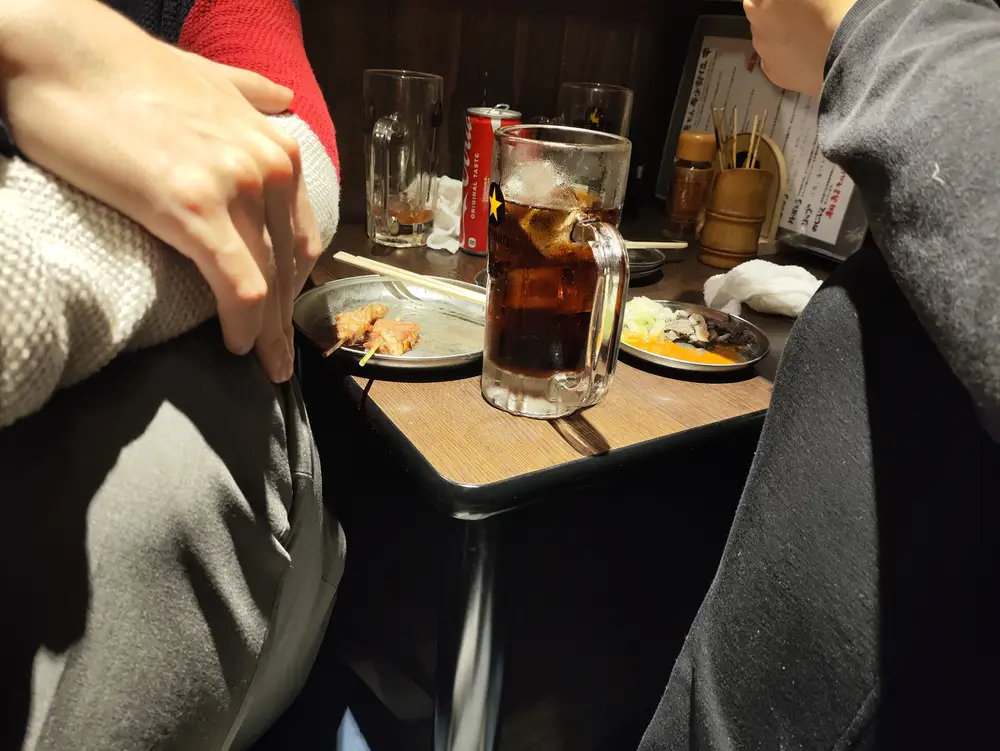
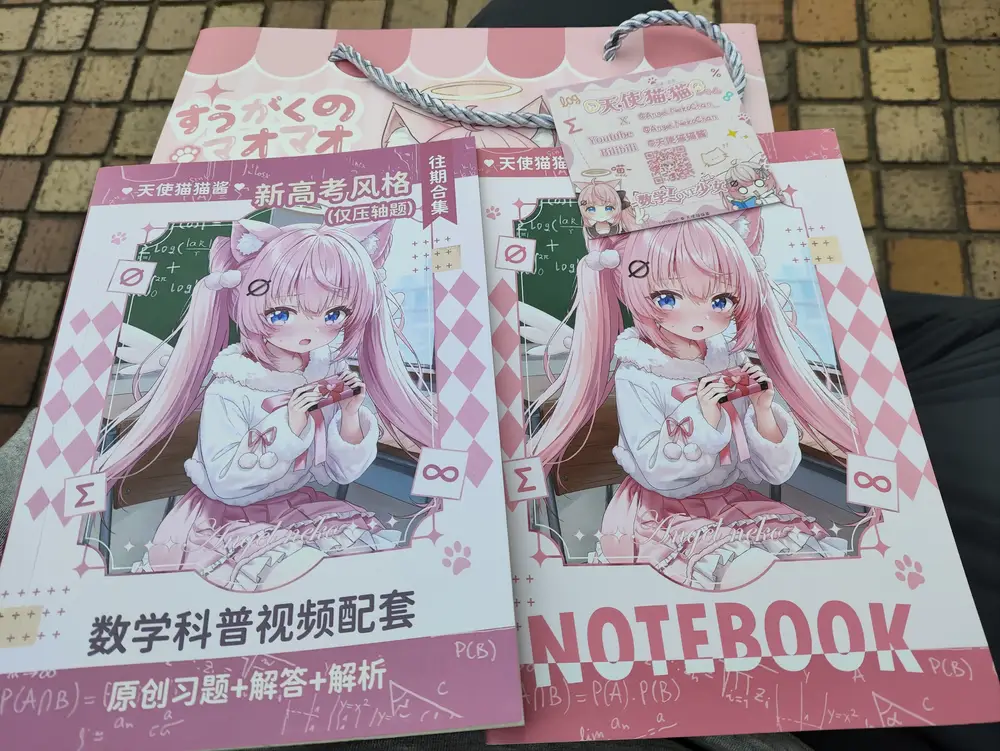
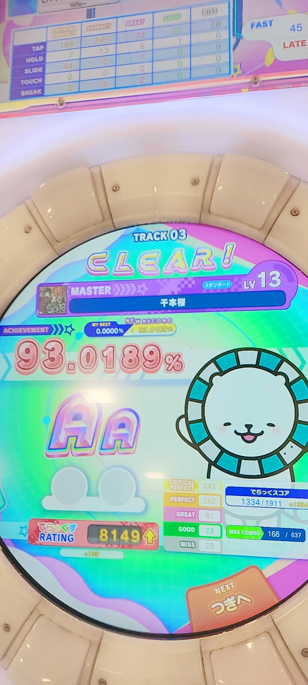
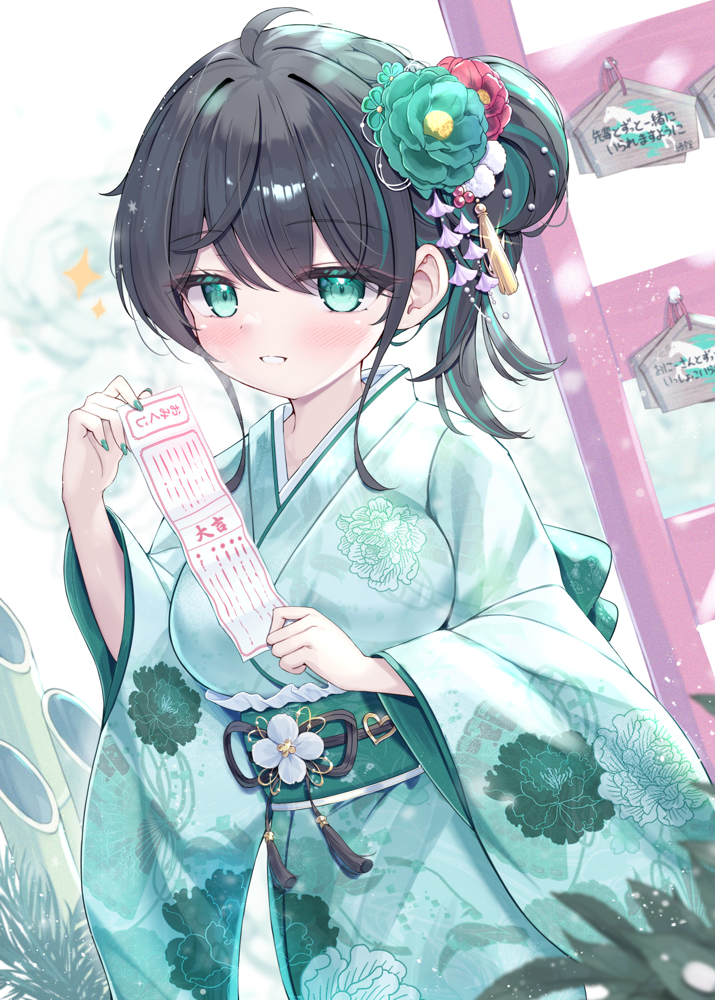

<small>`原发于清水河畔：沙比二刺猿的日本会议兼游记`</small>

写点流水账

坡县水硕时随组里三哥的指引投了篇天线水会，原组升博后导师叫我前去参会，一查在日本之后我那个开心啊

可惜实在是没有什么旅游经验，修改再三才终于在出发前三周定下了福冈开完会闪击东京的行程

然后我就经历了有生以来最快乐的11天

## ​

签证的准备还是非常折磨的，我见下签只需要五个工作日，便把办签日期拖到了出发前不到一个月。预约前一周收到三哥提醒说商务签要找会议方要邀请信，过两天又收到会议方提醒我没注册会议缴费我滴码我哪懂这个，赶忙注册了被日本人拖到办签前一天忍不住夺命连环催才下了邀请信煎熬程度堪比等offer，不过还好也是有惊无险。

# 第1天

新加坡直飞福冈只有凌晨一点起飞的红眼航班，硬逼自己睡了一晚上总算在落地时保留了足够的蓝条。

坐地铁到博多放下行李去吃拉面

`（高清图以后再整吧）`

吃完就去附近逛了下

东长寺外面没啥好看的，旁边楼的佛像还挺好看，可惜不让拍照

然后去栉田神社看巫女，说实话服装一般，顺便买点纪念品拍了点风景

运河城，普普通通的商场

猪排饭巨好吃，但是吃完容易喷射我不好评价

身为合格的舞萌吃，晚饭完当然是搜索最近机厅，没想到就在猪排饭同一栋楼

坐红眼航班到处逛了一天晚上还来上机，活爹你就造吧没打几把就蓝条归零回酒店躺尸了

不得不说泡澡堂太爽了

# 2

第二天去太宰府和博物馆

也没啥特别的，国内古迹不少见

看见了个勾玉没忍住直接买了，蒸批之魂在召唤

博物馆里也没啥，唯独这个刀的寒光我是真觉得好看

然后晚上换个新机厅继续出勤，问就是风景名胜不如转圈teto和眼罩初音

别说这桥上夜景真好看吧，虽然我舞萌吃完手抖拍糊了

# 3

然后就到了大型漫展开始

领无料

下午听讲座，太无聊溜了继续打卡新机厅

打完回来正好吃席

可惜师兄们在外面玩得比我还疯我只能孤独social，聊了几圈之后发现场里有妹妹的小团体我都插不上话，更孤独了

# 4

非常刻意地起晚了赶上开幕式后半场，吃完茶歇就跑了，到午饭才拿上海报找起更晚的师兄们集合

会场的午饭

小日子摆盘有一手，口感也还算可以，就是冷饭有点难绷

当了这么久的糙汉终于发现自己完全不会摆pose，仪容也没整理，老印师兄的拍照技术更是不敢恭维还没返原图给我收到返图微死了，不过好歹是打上了卡

`盒照当然是匿了`

`盒照当然是匿了`

站完街会场逛逛等晚饭，摆摊的日企口语真是难以下咽，好在我也是个结巴英语自信哥，磕磕绊绊竟然真能聊

晚饭吃一兰总店，比前两天的拉面好吃，但也贵不少，溢价还是有的

吃完再打卡新机厅问就是舞萌吃的职业素养

主题曲好玩

# 5

今日无事

逛了逛会场打了打舞萌然后去逛天神和运河城的谷子店，可惜IP不是很满意

整了个fumo和初音泡面压，还有色图挂画就不贴了

# 6

才知道有师兄没事直接跑出去疯了，痛定思痛决定也搜刮完茶歇和午饭去猛勤舞萌吃是真沾不得啊机厅离着会场足足三百米都会被自动吸附上去

勤完正好赶上晚宴

唉我草太高端了我这丑小鸭也有化身灰姑娘穿上水晶鞋的一天吗

当即开启一个蝗虫过境模式，我已经很努力了但还是炫不过师兄们这是真得学习一个

顺带一提这会皇帝轮流坐明年到泥点，电兵应水尽水

出来找表演武士的拍照，给我拍得像个大反派

怎么我拍照除了憨笑就是狞笑

`盒照当然是匿了`

# 7

舞萌吃几天也累了，酒店里大躺特躺，为飞东京补够蓝条（说是这么说但还是没忍住去机厅

正好是万圣夜，路上日本妹妹是真看爽了，回来还有派对，可惜人太多了还听不懂凑不了热闹

# 8

飞东京成田机场转半天才知道怎么充钱坐铁路进城，最后差半分钟只能赶下一班

青旅放完行李当然是直接传送到我们的圣地

可惜到太晚了草草逛了几家就打烊了

然后约罕见朋友泡小馆子

妈的你们小日子就吃这种东西还坐得难受感觉还不如新加坡的烧烤

回青旅后总结今日战绩带颜色的我就不放了虽然只是R15，我只能说twinbox的画太神了

这青旅是真不错，晚上睡觉一点不吵，味道有点但不多

# 9

寄存完行李去看了下浅草寺

唉我草全是人，小红书严选真不是吹的，直接润了

到了日本就整点天妇罗

本来打算接下来再战秋叶原的，突闻池袋有漫展，屁颠屁颠就过去了国内漫展就是看cos，小日子的漫展cos岂不是要上天

结果到了是一个cos都没有啊，全是大叔在那卖本子，但是本子也太合我胃口了，回过神来收了好多R18，这一趟来可太值了，还好新加坡海关不查

意外的是竟然偶遇了舞萌吃国v，整点高考材料等过年回去给家里小登来点管人震撼顺便拍了个合照

`盒照当然是匿了`

漫展完逛了逛附近就再战秋叶原了，路上遇到blendream爽抽徽章老日还是懂抽卡真是太爽了，找的画师也在我的XP上

漫展攻破了我的心理防线于是秋叶原也不怕收R18了

最后战绩总结裁了点不能放出来的

秋叶原逛完找筑波大学的狐朋狗友借宿，狠狠体验了一把日本的学园乡镇

# 10

筑波逛了一天，乡镇风景大同小异就没咋拍照，但晚秋的环境是真好，满足了我功成名就回乡下住大豪斯的幻想

当然出勤是少不了的，被千本樱地雷气晕

晚上水溅到充电口没注意到拿去充电把充电口干出焦味直接暴毙了，我抱着8%电量的手机做了第二天无数个预案，所幸睡醒竟然打赢复活赛了现在除了没了快充一切正常，脆皮的我何德何能有这么体育生的手机

# 11

充好电后去赶羽田的飞机，到秋叶原发现还有余量就再去抽了点徽章剩下了三百日元当然是去机厅用掉了，于是顺利爆勤签到拿下百合咲，顺便再爽teto

到机场发现还有大把时间，早知道把公交卡里的钱也花在机厅了

最后顺利回坡

如我所料包里的东西根本不查，要是我回国可不敢整R18

回来后最爽的是当社交恐怖分子问同事“你是二刺猿吗”然后塞个谷子给他师兄憋到说不出话来那我一眼就看出来他浓度可高了

